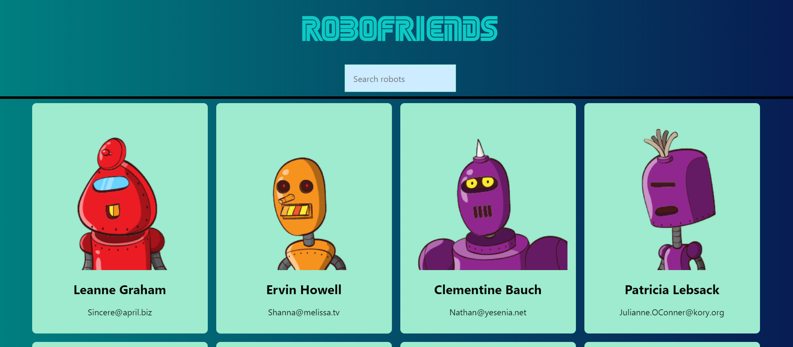

# My first website created using [Create React App](https://github.com/facebook/create-react-app).
 

* It grabs test users from JSON placeholder API and renders cards of random robots from Robohash API.

* Once the robots are loaded, you can search for specific names using the search box.  

* The state management is handled using [Redux](https://redux.js.org/).  

**Note: All the styles where made using the library [tachyons](https://tachyons.io/). The goal was React, not CSS.**  

**Clone this repo and `npm start` to see React at its simplest =)**