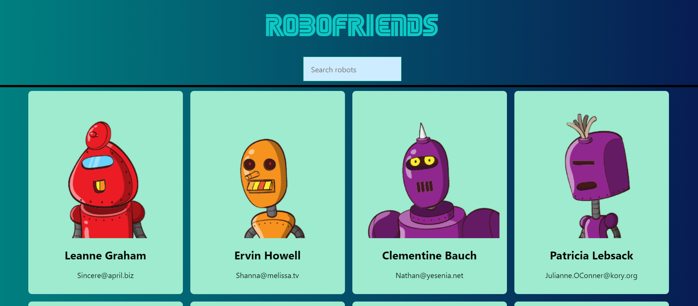

# First website created using [Create React App](https://github.com/facebook/create-react-app).
 

It grabs test users from JSON placeholder API and renders cards of random robots from Robohash API.  

Once the robots are loaded, you can search for specific names using the search box.  

The state management was updated to be handled using `Redux`.  

**Note: All the styles where made using the library `tachyons`. The goal whas React, not CSS**  

## clone `npm start` to see React at its simplest =)